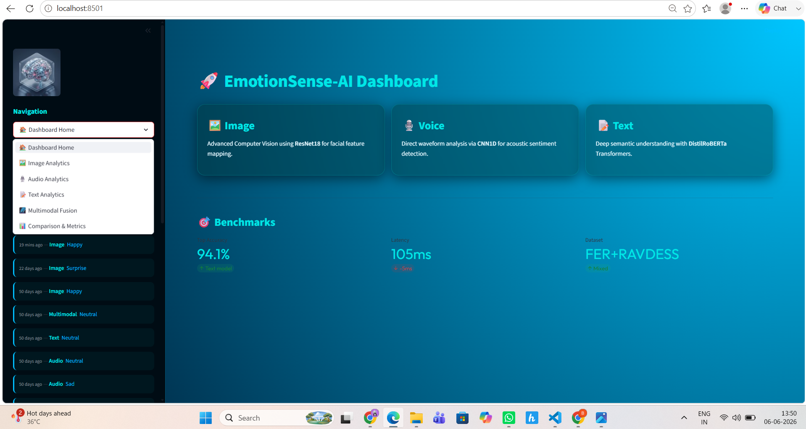
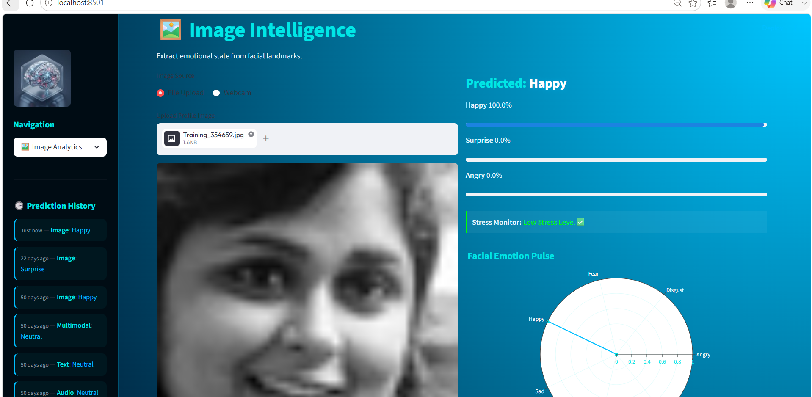
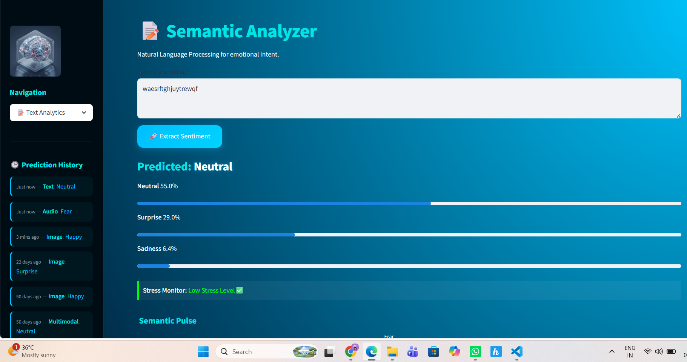
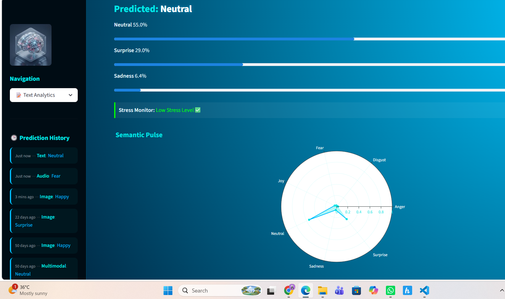
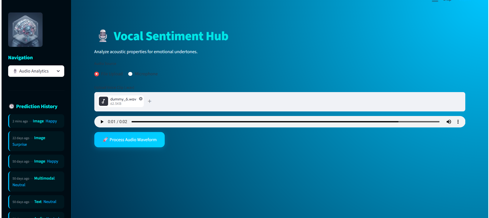
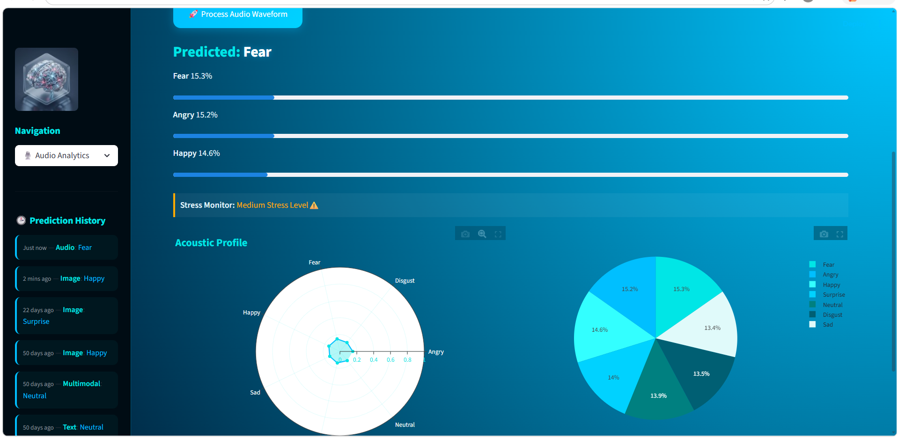
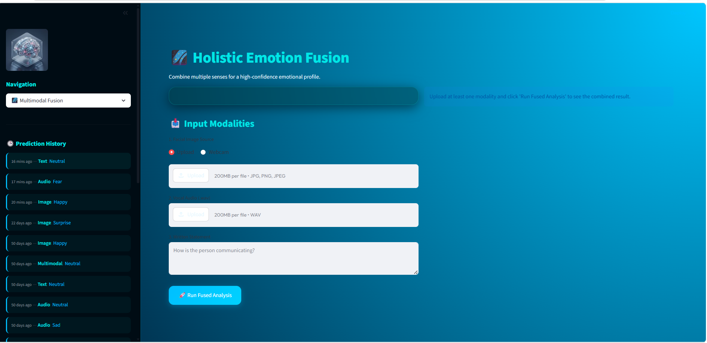

# EmotionSense-AI

Multimodal Emotion Recognition System

## Features

- Image Emotion Detection
- Audio Emotion Detection
- Text Emotion Detection
- Fusion Emotion Detection

## Models

- EfficientNet
- MobileNetV2
- VGG16
- CNN
- BERT
- LSTM
- Transformer

## Run

```bash
pip install -r requirements.txt
streamlit run app.py
```

## Demo Screenshots

### Home Page



### Image Emotion Detection



### Text Emotion Detection





### Audio Emotion Detection





### Fusion Prediction



### Demo Video for my project 

### project video link : https://drive.google.com/file/d/1D3NSU6uhZGbeKQ3OVp9nB7N4FFCjRAJQ/view?usp=sharing